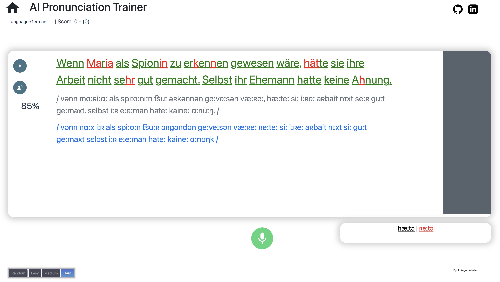

# AI Pronunciation Trainer 
This tool uses AI to evaluate your pronunciation so you can improve it and be understood more clearly. You can go straight test the tool at https://aipronunciationtr.com (please use the chrome browser for desktop and have some patience for it to "warm-up" :) ). 



## !! Update !! 

I'm happy (and surprised!) that apparently a considerable amount of people are using this tool, and this made -even more- clear that many things could be improved. I tried to solve the most critical issues with small changes on the code base, so that now: 
* Requirements are relaxed and should work with modern python versions (tested with 3.12)
* Whisper is used as standard ASR model 
* You can edit the text you want to speak by clicking on it and typing (please do before an evaluation)
* Code does not dependent on OR-Tools anymore, which makes is somewhat lighter and faster 
* Code is slightly changed so it is now easier to add more languages and change the database. 
* Errors will be shown on the console for easier debugging. 

I hope this facilitates the use of the tool and you have more fun (and learning!) with it. I plan to add those changes to the server in the coming weeks when I find some more time.

## Installation 
To run the program locally, you need to install the requirements and run the main python file:
```
pip install -r requirements.txt
python webApp.py
```
You'll also need ffmpeg, which you can download from here https://ffmpeg.org/download.html. On Windows, it may be needed to add the ffmpeg "bin" folder to your PATH environment variable. On Mac, you can also just run "brew install ffmpeg".

You should be able to run it locally without any major issues as long as you’re using a recent python 3.X version.  

## Online version
For the people who don’t feel comfortable running code or just want to have a quick way to use the tool, I hosted an online version of it at https://aipronunciationtr.com. It should work well in desktop-chrome, any other browser is not officially supported, although most of the functionality should work fine. 
 
Please be aware that the usage is limited by day (I’m still not rich ;)). If, for some reason, you would like to avoid the daily usage limit, just enter in contact and we see what we can do. 

## Motivation

Often, when we want to improve our pronunciation, it is very difficult to self-assess how good we’re speaking. Asking a native, or language instructor, to constantly correct us is either impractical, due to monetary constrains, or annoying due to simply being too boring for this other person. Additionally, they may often say “it sounds good” after your 10th try to not discourage you, even though you may still have some mistakes in your pronunciation. 

The AI pronunciation trainer is a way to provide objective feedback on how well your pronunciation is in an automatic and scalable fashion, so the only limit to your improvement is your own dedication. 

This project originated from a small program that I did to improve my own pronunciation.  When I finished it, I believed it could be a useful tool also for other people trying to be better understood, so I decided to make a simple, more user-friendly version of it. 

## Disclaimer 
This is a simple project that I made in my free time with the goal to be useful to some people. It is not perfect, thus be aware that some small bugs may be present. In case you find something is not working, all feedback is welcome, and issues may be addressed depending on their severity.

## FAQ

### How do I add a new language?

There's definitely a code architecture that would allow this to be easier, but I have limited time and I think the current solution is doable with relative ease. What you need to do is: 
#### Backend 
As long as your language is supported by Whisper, you need only a database and small changes in key files:

1. Add your language identifier to the "lambdaGetSample.py" file
2. Add a .csv file with your text database in the "./databases" folder, following the naming convention 
3. Add a corresponding phonem model in the "RuleBasedModels.py", you likely need only to give the language code to Epitran and possibly correct some characters with a wrapper 
4. Add your trainer to "lambdaSpeechToScore.py" with the correct language code

If you language is not supported by Whisper, you need to have an Speech-To-Text model and add it to the "getASRModel" function in "models.py", and it needs to implement the "IASRModel" interface. Besides this, you need to do the same as above.
#### Frontend 

1. In the "callback.js" function, add a case for your language 
2. In the "main.html", add your language in the "languageBox" with corresponding call to the javascript function. 