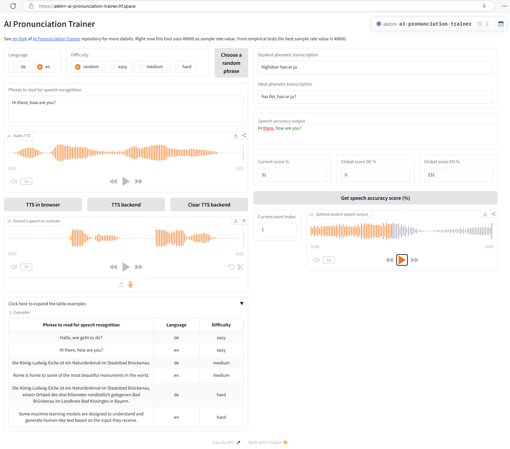

# AI Pronunciation Trainer

This repository refactor [Thiagohgl](https://github.com/Thiagohgl)'s [AI Pronunciation Trainer](https://github.com/Thiagohgl/ai-pronunciation-trainer) project, a tool that uses AI to evaluate your pronunciation so you can improve it and be understood more clearly.
You can try my [refactored version](https://github.com/trincadev/ai-pronunciation-trainer) both locally or online, using my [HuggingFace Space](https://huggingface.co/spaces/aletrn/ai-pronunciation-trainer):

[](https://aletrn-ai-pronunciation-trainer.hf.space/)

My [HuggingFace Space](https://huggingface.co/spaces/aletrn/ai-pronunciation-trainer) is free of charge: for this reason is the less powerful version and the speech recognition could take some seconds.

## Installation

To run the program locally, you need to install the requirements and run the main python file.
These commands assume you have an active virtualenv (locally I'm using python 3.12, on HuggingFace the gradio SDK - version 5.6.0 at the moment - uses python 3.10):

```bash
pip install -r requirements.txt
python webApp.py
```

On Windows you can also use WSL2 to spin a Linux instance on your installation, then you don't need any particular requirements to work on it.
You'll also need ffmpeg, which you can download from here <https://ffmpeg.org/download.html>. You can install it on base Windows using the command `winget install ffmpeg`, it may be needed to add the ffmpeg "bin" folder to your PATH environment variable. On Mac, you can also just run "brew install ffmpeg".

You should be able to run it locally without any major issues as long as you’re using a recent python 3.X version.

## Changes on [trincadev's](https://github.com/trincadev/) [repository](https://github.com/trincadev/ai-pronunciation-trainer)

Currently the best way to exec the project is using the Gradio frontend:

```bash
python app.py
```

I upgraded the old custom frontend (iQuery@3.7.1, Bootstrap@5.3.3) and backend (pytorch==2.5.1, torchaudio==2.5.1) libraries. On macOS intel it's possible to install from [pypi.org](https://pypi.org/project/torch/) only until the library version [2.2.2](https://pypi.org/project/torch/2.2.2/)
(see [this github issue](https://github.com/instructlab/instructlab/issues/1469) and [this deprecation notice](https://dev-discuss.pytorch.org/t/pytorch-macos-x86-builds-deprecation-starting-january-2024/1690)).

In case of missing TTS voices needed by the Text-to-Speech in-browser SpeechSynthesis feature (e.g. on Windows 11 you need to install manually the TTS voices for the languages you need), right now the Gradio frontend raises an alert message with a JavaScript message.
In this case the TTS in-browser feature isn't usable and the users should use the backend TTS feature.

## Python test cases (also enhanced with a mutation test suite)

After reaching a test coverage of 89%, I tried the [`cosmic-ray`](https://cosmic-ray.readthedocs.io/) [mutant test suite](https://en.wikipedia.org/wiki/Mutation_testing) and I found out that I missed some spots.
For this reason I started to improve my test cases (one module at time to avoid waiting too long):

```bash
python .venv312/bin/cosmic-ray init cosmic_ray_config.toml cosmic_ray.sqlite
python .venv312/bin/cosmic-ray --verbosity=INFO baseline cosmic_ray_config.toml
python .venv312/bin/cosmic-ray exec cosmic_ray_config.toml cosmic_ray.sqlite
cr-html cosmic_ray.sqlite > tmp/cosmic-ray-speechtoscore.html
```

The `cosmic_ray_config.toml` I'm using now (the tests for the `lambdaSpeechToScore` module are in two different files to avoid too code in only one):

```toml
[cosmic-ray]
module-path = "aip_trainer/lambdas/lambdaSpeechToScore.py"
timeout = 30.0
excluded-modules = []
test-command = "python -m pytest tests/lambdas/test_lambdaSpeechToScore.py tests/lambdas/test_lambdaSpeechToScore_librosa.py"

[cosmic-ray.distributor]
name = "local"
```

In this case my 'mutant' test coverage progression (Total jobs: 377 / Complete: 377, 100.00%):

1. Surviving mutants: 181 (48.01%)
2. Surviving mutants: 74 (19.63%)
3. Surviving mutants: 3 (0.80%)

In case of errors on executing the `pytest` files remove the python cache before re-run the tests:

```bash
find tests -name "__pycache__" -exec rm -rf {} \;
find aip_trainer -name "__pycache__" -exec rm -rf {} \;
```

Then execute the tests again:

```bash
python -m pytest tests/models/test_models_faster_whisper.py; echo "# start pytest complete test suite #"; IS_TESTING=TRUE python -m pytest tests --cov="." --cov-report=term-missing && coverage html
```

### Backend tests execution on Windows

On Windows the tests suite needs the env variable `PYTHONUTF8=1` to avoid an UnicodeDecodeError:

```cmd
PYTHONUTF8=1 pytest --cov=aip_trainer --cov-report=term-missing && coverage html
```

### E2E tests with playwright

Normally I use Visual Studio Code to write and execute my playwright tests, however it's always possible to run them from cli (from the `static` folder, using a node package manager like `npm` or `pnpm`):

```bash
pnpm install
pnpm playwright test --workers 1 --retries 4 --project=chromium
```

### Unused classes and functions (now removed)

- `models.getTTSModel()`
- `pronunciationTrainer.getWordsRelativeIntonation()`
- `WordMatching.get_best_mapped_words_dtw()`
- `WordMatching.parseLetterErrorsToHTML()`

### DONE

- Original frontend - upgrade iQuery@3.7.1, Bootstrap@5.3.3
- Upgraded Speech-to-Text German [Silero](https://github.com/snakers4/silero-models) model that blocked the upgrade to PyTorch > 2.x
- Upgraded PyTorch > 2.x
- Improved backend tests with the [mutation test suite](https://en.wikipedia.org/wiki/Mutation_testing) [Cosmic Ray](https://cosmic-ray.readthedocs.io)
- E2E [playwright](https://playwright.dev) tests
- Added a new frontend based on [Gradio](https://gradio.app)
- add an updated online version ([HuggingFace Space](https://huggingface.co/spaces/aletrn/ai-pronunciation-trainer))
- Only on the Gradio frontend version - it's possible to insert custom sentences to read and evaluate
- Gradio frontend version - play the isolated words in the recordings, to compare the 'ideal' pronunciation with the learner pronunciation
- Gradio frontend version - re-added the Text-to-Speech in-browser (it works only if there are installed the required language packages. In case of failures there is the backend Text-to-Speech feature)
- Fixed a [bug](https://github.com/Thiagohgl/ai-pronunciation-trainer/issues/14) with [whisper](https://huggingface.co/docs/transformers/model_doc/whisper) not properly transcribing the end timestamp for the last word in the recorded audio (in the end I solved it switching to [whisper python pip package](https://pypi.org/project/openai-whisper/))
- Added [faster whisper](https://pypi.org/project/faster-whisper/) model support:
    - it avoid `None` values on `end_ts` timestamps for the last elements, unlike the HuggingFace Whisper's output
    - it uses silero-vad to detect long silences within the audio

### TODO

- improve documentation (especially function docstrings), backend tests
- move from pytorch to onnxruntime (if possible)
- re-add the docker container (if possible)

## Motivation

Often, when we want to improve our pronunciation, it is very difficult to self-assess how good we’re speaking. Asking a native, or language instructor, to constantly correct us is either impractical, due to monetary constrains, or annoying due to simply being too boring for this other person. Additionally, they may often say “it sounds good” after your 10th try to not discourage you, even though you may still have some mistakes in your pronunciation.

The AI pronunciation trainer is a way to provide objective feedback on how well your pronunciation is in an automatic and scalable fashion, so the only limit to your improvement is your own dedication.

This project originated from a small program that I did to improve my own pronunciation.  When I finished it, I believed it could be a useful tool also for other people trying to be better understood, so I decided to make a simple, more user-friendly version of it.

## Disclaimer

This is a simple project that I made in my free time with the goal to be useful to some people. It is not perfect, thus be aware that some small bugs may be present. In case you find something is not working, all feedback is welcome, and issues may be addressed depending on their severity.
